# 🏗️ 災民補助申請系統 - 系統架構文件

## 📋 目錄

1. [系統架構圖](#系統架構圖)
2. [資料庫架構圖](#資料庫架構圖)
3. [API 路由架構](#api-路由架構)
4. [檔案結構](#檔案結構)
5. [技術堆疊](#技術堆疊)

---

## 系統架構圖

### 整體系統架構 (System Architecture)

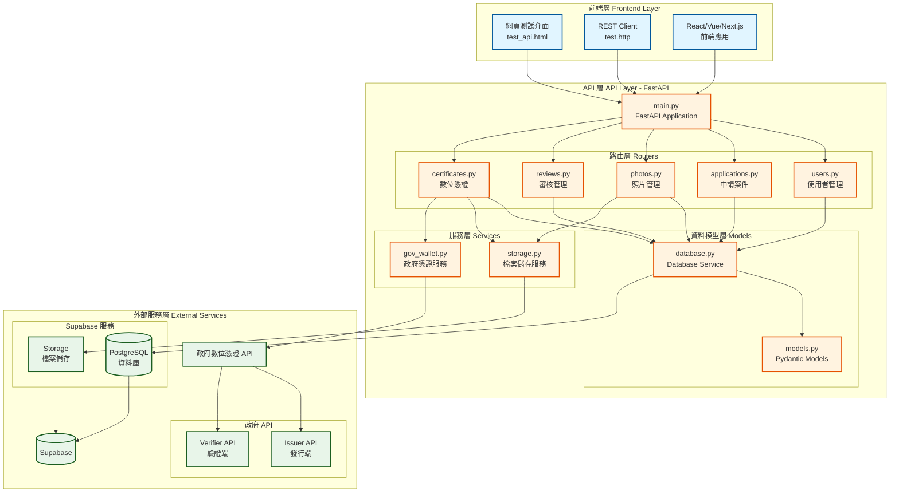

### 請求處理流程 (Request Flow)

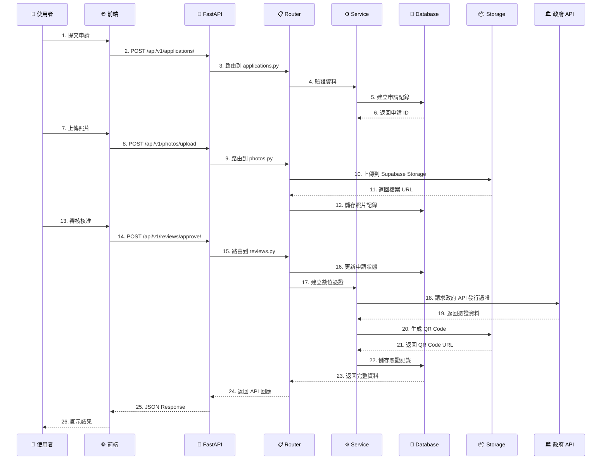

---

## 資料庫架構圖

### Entity-Relationship Diagram (ERD)

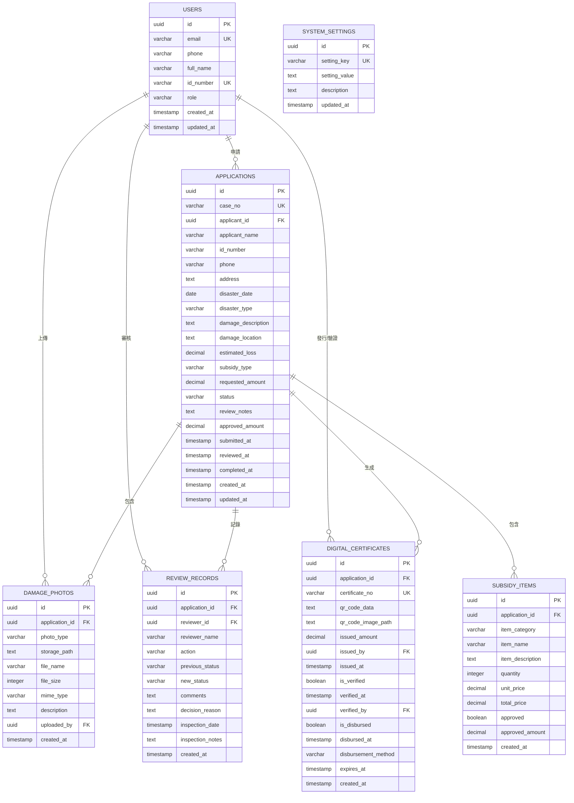

### 資料表關係說明

| 資料表 | 中文名稱 | 關聯 | 說明 |
|--------|----------|------|------|
| `users` | 使用者表 | - | 儲存災民、審核員、管理員資料 |
| `applications` | 申請案件表 | → users | 災民的補助申請案件主表 |
| `damage_photos` | 災損照片表 | → applications, users | 災前/災後/現場勘查照片 |
| `review_records` | 審核記錄表 | → applications, users | 完整的審核歷程記錄 |
| `digital_certificates` | 數位憑證表 | → applications, users | QR Code 數位憑證 |
| `subsidy_items` | 補助項目表 | → applications | 申請的補助項目明細 |
| `system_settings` | 系統設定表 | - | 系統參數設定 |

---

## API 路由架構

### API 端點樹狀圖

```mermaid
graph TB
    Root["根路徑 /"] --> Health["健康檢查 /health"]
    Root --> API["API /api/v1"]
    Root --> Docs["文件 /docs"]
    Root --> Test["測試頁面 /test"]
    
    API --> Users["使用者 /users"]
    API --> Apps["申請案件 /applications"]
    API --> Photos["照片管理 /photos"]
    API --> Reviews["審核管理 /reviews"]
    API --> Certs["數位憑證 /certificates"]
    API --> Stats["統計資料 /stats"]
    
    Users --> UserCreate["POST /users/<br/>建立使用者"]
    Users --> UserGet["GET /users/:id<br/>查詢使用者"]
    Users --> UserGetEmail["GET /users/email/:email<br/>依 Email 查詢"]
    Users --> UserUpdate["PATCH /users/:id<br/>更新使用者"]
    Users --> UserList["GET /users/<br/>列出所有使用者"]
    
    Apps --> AppCreate["POST /applications/<br/>建立申請"]
    Apps --> AppGet["GET /applications/:id<br/>查詢申請"]
    Apps --> AppGetCase["GET /applications/case-no/:no<br/>依案件編號查詢"]
    Apps --> AppGetApplicant["GET /applications/applicant/:id<br/>查詢申請人案件"]
    Apps --> AppUpdate["PATCH /applications/:id<br/>更新申請"]
    Apps --> AppGetStatus["GET /applications/status/:status<br/>依狀態查詢"]
    
    Photos --> PhotoUpload["POST /photos/upload<br/>上傳照片"]
    Photos --> PhotoMultiple["POST /photos/upload-multiple<br/>批次上傳"]
    Photos --> PhotoGet["GET /photos/application/:id<br/>查詢案件照片"]
    Photos --> PhotoDelete["DELETE /photos/:id<br/>刪除照片"]
    Photos --> PhotoInspection["POST /photos/inspection/upload<br/>上傳勘查照片"]
    
    Reviews --> ReviewCreate["POST /reviews/<br/>建立審核記錄"]
    Reviews --> ReviewGet["GET /reviews/application/:id<br/>查詢審核記錄"]
    Reviews --> ReviewApprove["POST /reviews/approve/:id<br/>核准申請"]
    Reviews --> ReviewReject["POST /reviews/reject/:id<br/>駁回申請"]
    
    Certs --> CertCreate["POST /certificates/<br/>建立憑證"]
    Certs --> CertGet["GET /certificates/:no<br/>查詢憑證"]
    Certs --> CertGetApp["GET /certificates/application/:id<br/>查詢案件憑證"]
    Certs --> CertScan["POST /certificates/scan/:no<br/>掃描憑證"]
    Certs --> CertVerify["POST /certificates/gov/verify-qr<br/>政府 API 驗證"]
    Certs --> CertRequest["POST /certificates/gov/create-verification-request<br/>建立驗證請求"]
    
    classDef root fill:#ffcdd2,stroke:#c62828,stroke-width:2px
    classDef group fill:#fff9c4,stroke:#f57f00,stroke-width:2px
    classDef endpoint fill:#bbdefb,stroke:#1976d2,stroke-width:2px
    
    class Root,Health,Docs,Test root
    class API,Users,Apps,Photos,Reviews,Certs,Stats group
    class UserCreate,UserGet,UserGetEmail,UserUpdate,UserList,AppCreate,AppGet,AppGetCase,AppGetApplicant,AppUpdate,AppGetStatus,PhotoUpload,PhotoMultiple,PhotoGet,PhotoDelete,PhotoInspection,ReviewCreate,ReviewGet,ReviewApprove,ReviewReject,CertCreate,CertGet,CertGetApp,CertScan,CertVerify,CertRequest endpoint
```

### API 端點統計

| 路由群組 | 端點數量 | 主要功能 |
|----------|----------|----------|
| 使用者管理 | 5 | 建立、查詢、更新使用者 |
| 申請案件 | 6 | 申請建立、查詢、狀態管理 |
| 照片管理 | 5 | 上傳、查詢、刪除照片 |
| 審核管理 | 4 | 審核記錄、核准、駁回 |
| 數位憑證 | 6 | 憑證發行、驗證、政府 API |
| 統計資料 | 1 | 系統統計資訊 |
| **總計** | **27** | - |

---

## 檔案結構

### 專案目錄樹

```
Mix_Curry/
├── 📄 main.py                    # FastAPI 主應用程式
├── 📄 command.py                 # 資料庫管理工具
├── 📄 requirements.txt           # Python 依賴套件
├── 📄 pyproject.toml            # 專案配置文件
├── 📄 .env                       # 環境變數（需自行建立）
│
├── 📁 app/                       # 應用程式主目錄
│   ├── 📄 settings.py           # 應用程式設定
│   │
│   ├── 📁 models/               # 資料模型
│   │   ├── 📄 models.py        # Pydantic 資料模型
│   │   └── 📄 database.py      # 資料庫服務層
│   │
│   ├── 📁 routers/              # API 路由
│   │   ├── 📄 users.py         # 使用者路由
│   │   ├── 📄 applications.py  # 申請案件路由
│   │   ├── 📄 photos.py        # 照片管理路由
│   │   ├── 📄 reviews.py       # 審核管理路由
│   │   └── 📄 certificates.py  # 數位憑證路由
│   │
│   └── 📁 services/             # 服務層
│       ├── 📄 storage.py       # 檔案儲存服務
│       └── 📄 gov_wallet.py    # 政府憑證服務
│
├── 📁 static/                    # 靜態檔案
│   └── 📄 test_api.html        # 網頁測試介面
│
├── 📁 https/                     # HTTP 測試檔案
│   ├── 📄 test.http            # API 測試集合
│   ├── 📄 README.md            # 測試說明文件
│   ├── 📄 create_test_images.py # 測試圖片生成工具
│   └── 📁 test_images/         # 測試圖片資料夾
│
├── 📁 docs/                      # 文件
│   ├── 📄 README.md            # 專案主文件
│   ├── 📄 FRONTEND_GUIDE.md    # 前端整合指南
│   ├── 📄 QUICKSTART_FRONTEND.md # 前端快速上手
│   ├── 📄 GOV_API_INTEGRATION.md # 政府 API 整合
│   └── 📄 ARCHITECTURE.md      # 系統架構文件（本文件）
│
└── 📄 database_schema.sql       # 資料庫結構 SQL
```

### 分層架構說明

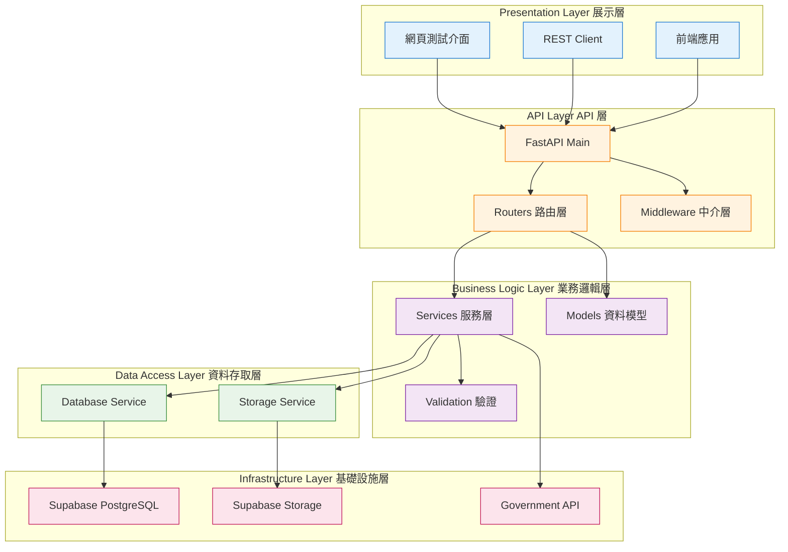

---

## 技術堆疊

### 後端技術棧

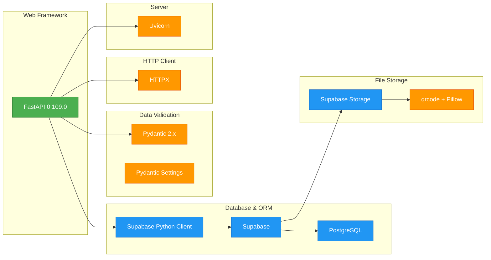

### 前端技術棧

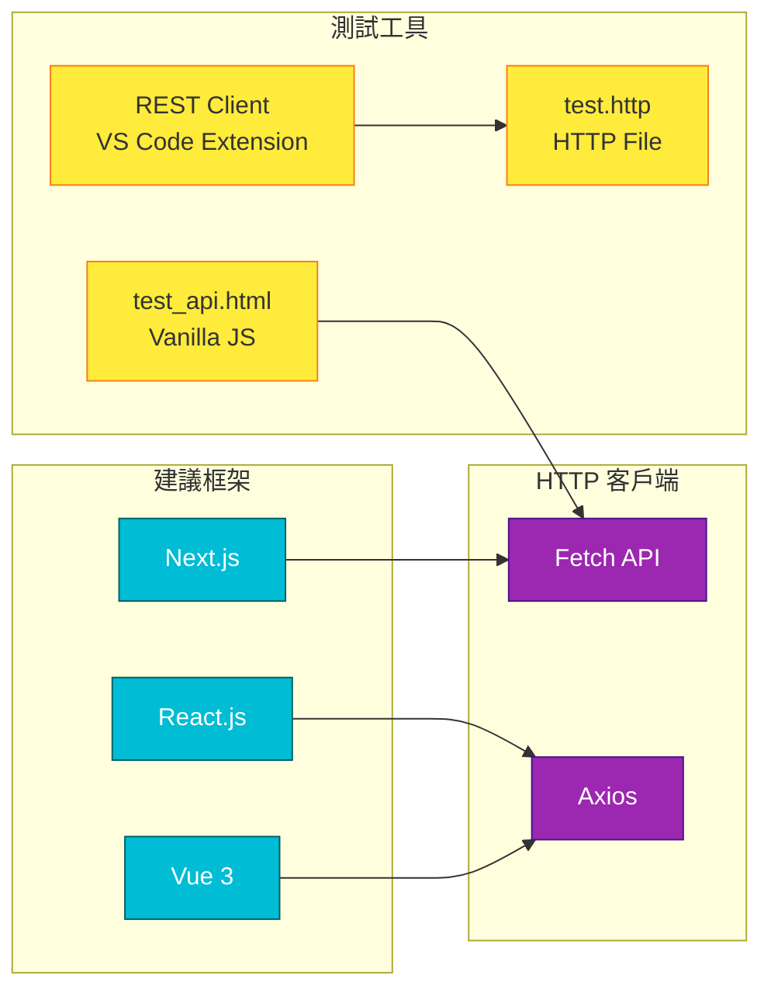

### 外部服務整合

| 服務類型 | 服務名稱 | 用途 | 狀態 |
|----------|----------|------|------|
| 資料庫 | Supabase PostgreSQL | 資料儲存 | ✅ 已整合 |
| 檔案儲存 | Supabase Storage | 照片、QR Code 儲存 | ✅ 已整合 |
| 政府 API | Issuer API | 數位憑證發行 | ✅ 已整合 |
| 政府 API | Verifier API | 憑證驗證 | ✅ 已整合 |
| API 文件 | Swagger UI | 互動式 API 文件 | ✅ 已整合 |
| API 文件 | ReDoc | API 參考文件 | ✅ 已整合 |

---

## 資料流向圖

### 災民申請流程

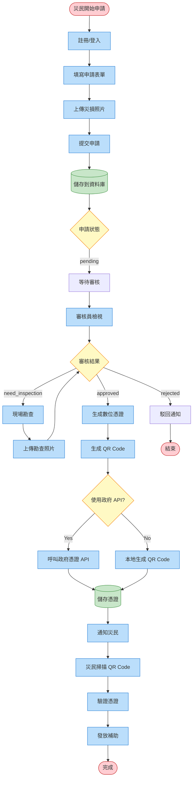

---

## 安全性架構

### 安全層級

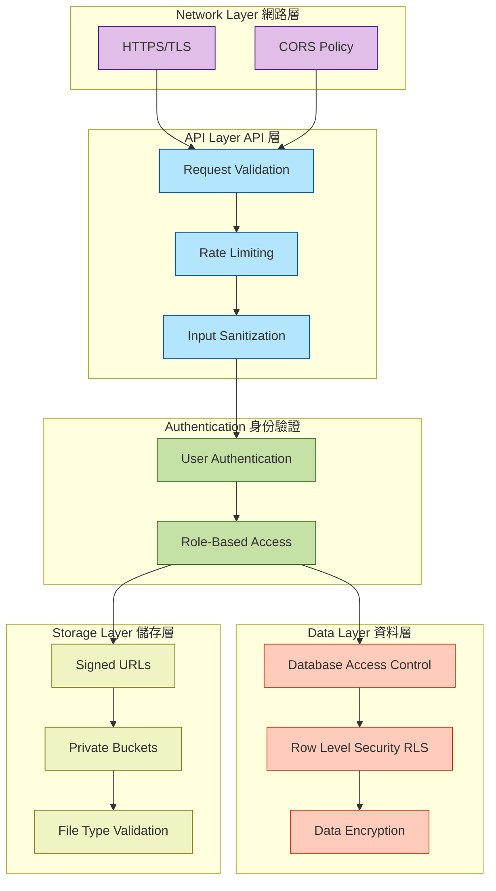

---

## 效能優化

### 快取策略

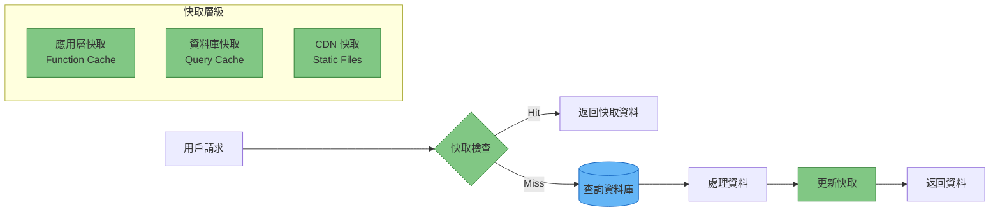

### 索引優化

資料庫已建立的索引：
- ✅ `users.email` - 快速查詢使用者
- ✅ `users.id_number` - 身分證字號查詢
- ✅ `applications.case_no` - 案件編號查詢
- ✅ `applications.applicant_id` - 申請人案件查詢
- ✅ `applications.status` - 狀態過濾查詢
- ✅ `damage_photos.application_id` - 照片關聯查詢
- ✅ `review_records.application_id` - 審核記錄查詢
- ✅ `digital_certificates.certificate_no` - 憑證編號查詢

---

## 部署架構

### 生產環境部署圖

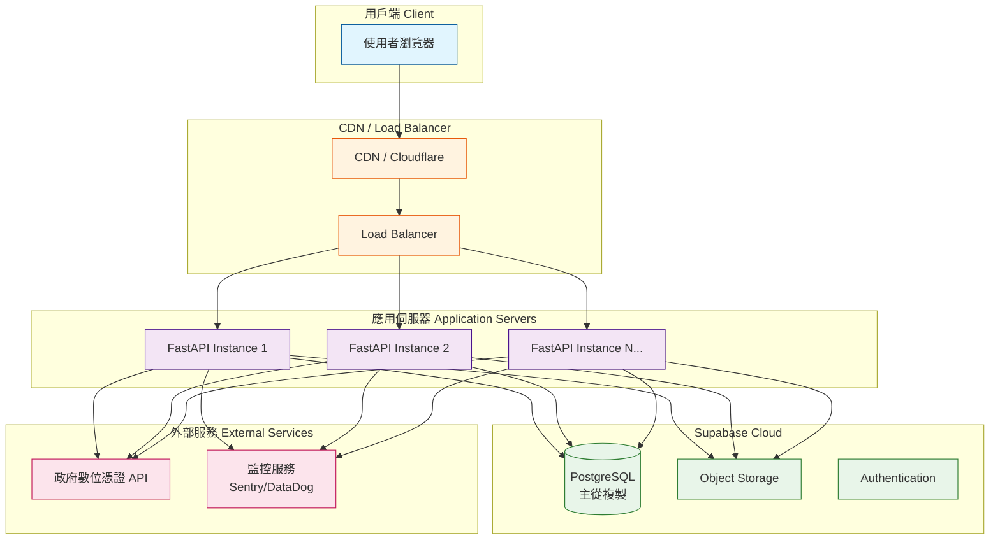

---

## 監控與日誌

### 監控架構

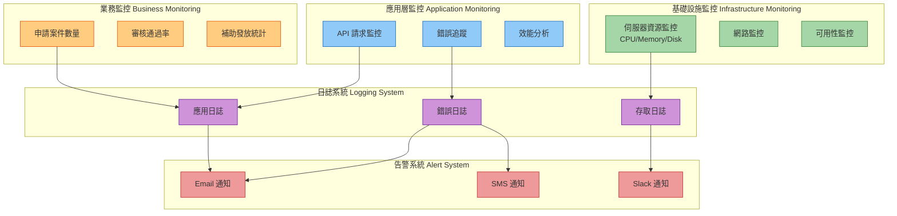

---

## 未來擴展

### 功能擴展計畫

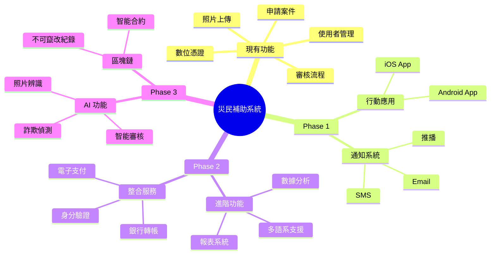

---

## 總結

### 系統特色

✅ **模組化設計** - 清晰的分層架構，易於維護和擴展  
✅ **RESTful API** - 標準化的 API 設計，前後端分離  
✅ **完整測試** - 網頁介面、HTTP 檔案、自動化測試  
✅ **政府整合** - 串接政府數位憑證沙盒 API  
✅ **安全可靠** - 多層安全機制，資料加密保護  
✅ **效能優化** - 資料庫索引、快取策略  
✅ **文件完善** - API 文件、架構圖、使用指南  

### 技術亮點

🚀 **FastAPI** - 高效能、自動生成 API 文件  
🗄️ **Supabase** - 開源 Firebase 替代方案  
🔐 **數位憑證** - 政府 API 整合，QR Code 驗證  
📊 **資料完整** - 完整的審核歷程記錄  
🖼️ **檔案管理** - Supabase Storage 整合  

---

**文件版本**: 1.0.0  
**最後更新**: 2025-10-14  
**維護者**: Mix_Curry Development Team

