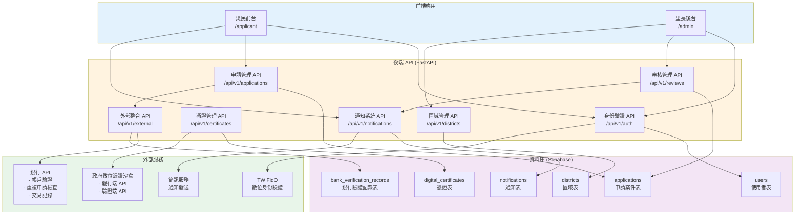
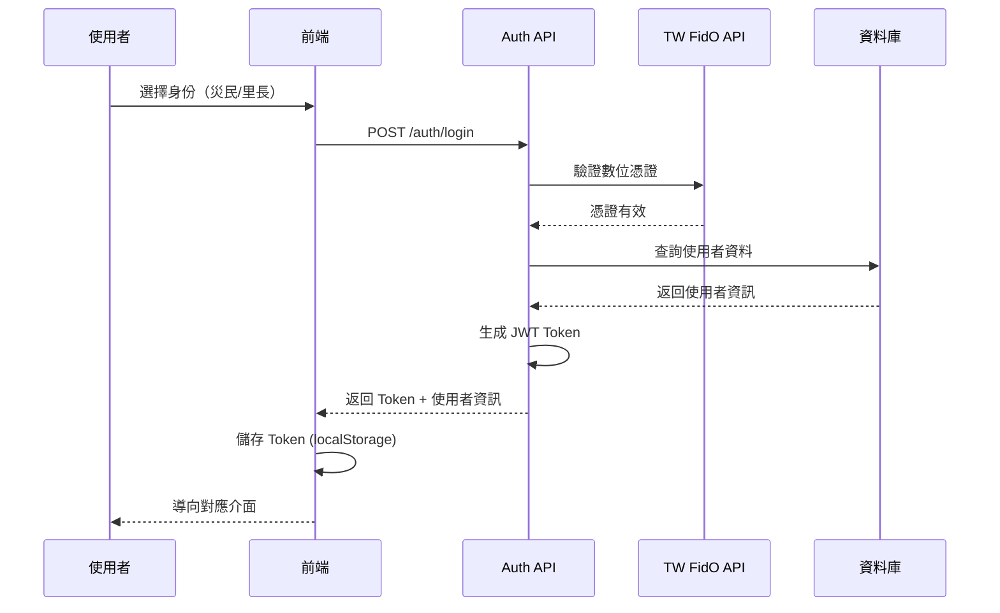
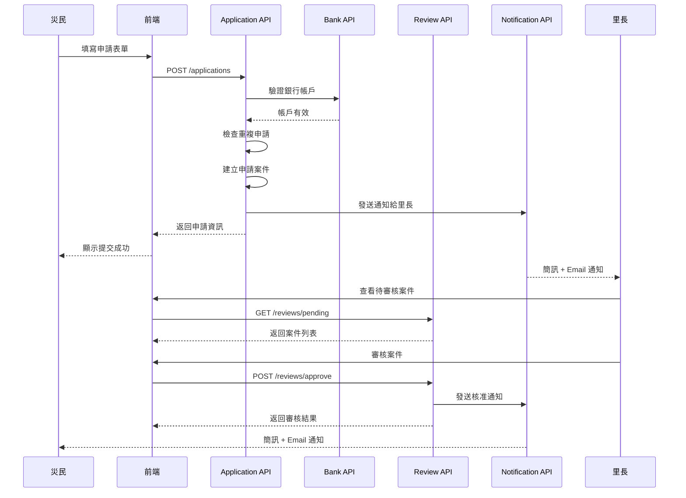
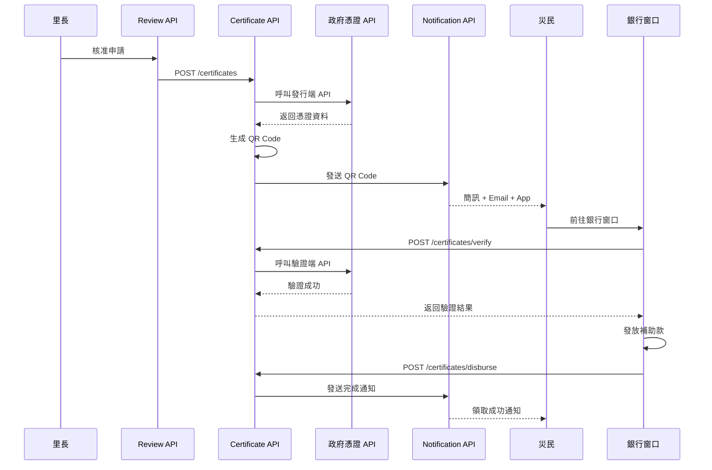
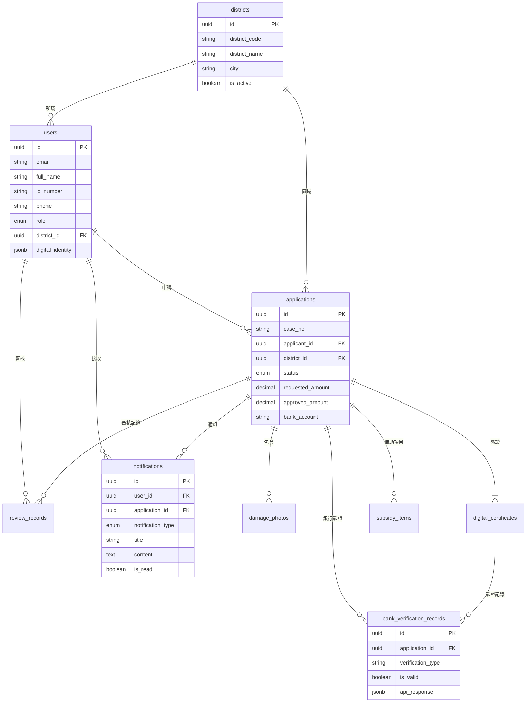

# 🌊 災民補助申請系統 - 完整流程圖

## 📊 系統架構概述

本系統採用**統一後端、分離前後台**的架構設計：
- ✅ 後端 API 統一管理（FastAPI）
- ✅ 前端分為災民端 (`/applicant`) 和里長端 (`/admin`)
- ✅ 整合銀行 API 和政府數位憑證沙盒

---

## 🎯 完整業務流程圖

```mermaid
flowchart TD
    Start([使用者開啟系統]) --> LoginChoice{選擇身份}
    
    %% ========== 災民流程 ==========
    LoginChoice -->|我是災民| ApplicantLogin[災民登入/註冊]
    ApplicantLogin --> DigitalIDCheck{數位憑證驗證<br/>TW FidO API}
    DigitalIDCheck -->|驗證失敗| LoginFailed[顯示錯誤訊息]
    LoginFailed --> ApplicantLogin
    DigitalIDCheck -->|驗證成功| CheckDuplicate{檢查是否重複申請<br/>本地DB + 銀行API}
    
    CheckDuplicate -->|已申請過| ShowExisting[顯示現有申請狀態<br/>及補助記錄]
    CheckDuplicate -->|首次申請| FillForm[填寫申請表單<br/>- 基本資料<br/>- 災損描述<br/>- 銀行帳戶]
    
    FillForm --> UploadPhotos[上傳災損照片<br/>- 災前照片<br/>- 災後照片<br/>- 其他證明]
    UploadPhotos --> BankAPICheck[呼叫銀行API<br/>驗證帳戶有效性]
    BankAPICheck -->|帳戶無效| BankError[提示帳戶錯誤<br/>請修正帳號]
    BankError --> FillForm
    BankAPICheck -->|帳戶有效| SubmitApp[提交申請]
    SubmitApp --> StatusPending[狀態: 審核中<br/>pending]
    StatusPending --> SendNotification1[發送通知給區域里長]
    SendNotification1 --> WaitReview[等待里長審核]
    
    %% ========== 里長流程 ==========
    LoginChoice -->|我是里長| AdminLogin[里長登入<br/>輸入帳號密碼]
    AdminLogin --> AdminAuth{身份驗證<br/>+ 區域權限檢查}
    AdminAuth -->|驗證失敗| AdminLoginFailed[顯示錯誤訊息]
    AdminLoginFailed --> AdminLogin
    AdminAuth -->|驗證成功| AdminDashboard[里長管理後台<br/>- 待審核案件數<br/>- 本區統計資料]
    
    AdminDashboard --> ViewApplications[查看本區申請案件<br/>按區域篩選]
    ViewApplications --> SelectCase[選擇案件審核<br/>查看詳細資訊]
    SelectCase --> ReviewCase[查看申請資料<br/>- 災民資料<br/>- 災損照片<br/>- 申請項目]
    
    ReviewCase --> ReviewDecision{審核判斷}
    
    %% 需要補件
    ReviewDecision -->|需要補件| RequestMore[發送補件通知<br/>說明需補充內容]
    RequestMore --> NotifyApplicant1[系統通知災民<br/>簡訊 + Email + App]
    NotifyApplicant1 --> StatusSupplementing[狀態: 補件中<br/>supplementing]
    StatusSupplementing --> ApplicantSupplements[災民補充資料/照片<br/>或回覆說明]
    ApplicantSupplements --> NotifyAdmin1[通知里長已補件]
    NotifyAdmin1 --> ViewApplications
    
    %% 需現場勘查
    ReviewDecision -->|需現場勘查| ScheduleInspection[安排現場勘查<br/>設定勘查時間]
    ScheduleInspection --> NotifyApplicant3[通知災民勘查時間]
    NotifyApplicant3 --> StatusInspecting[狀態: 勘查中<br/>inspecting]
    StatusInspecting --> OnSiteInspection[里長現場勘查<br/>實地查看災損]
    OnSiteInspection --> UploadInspectionPhotos[上傳勘查照片<br/>填寫勘查報告]
    UploadInspectionPhotos --> ReviewCase
    
    %% 駁回申請
    ReviewDecision -->|駁回申請| RejectApp[駁回並填寫原因<br/>說明駁回理由]
    RejectApp --> NotifyApplicant2[通知災民駁回<br/>及駁回原因]
    NotifyApplicant2 --> StatusRejected[狀態: 已駁回<br/>rejected]
    
    %% 核准申請
    ReviewDecision -->|核准申請| ApproveApp[核准申請<br/>設定核准金額]
    ApproveApp --> BankVerification[銀行帳戶最終驗證<br/>確認帳戶狀態]
    BankVerification -->|驗證失敗| BankVerifyError[通知帳戶問題<br/>要求更新帳戶]
    BankVerifyError --> RequestMore
    
    BankVerification -->|驗證成功| GenerateCert[生成數位憑證<br/>記錄核准資訊]
    GenerateCert --> GenerateQR[生成 QR Code<br/>包含憑證資訊]
    GenerateQR --> CallGovAPI[呼叫政府憑證沙盒API<br/>發行端 API]
    CallGovAPI --> SendQR[發送 QR Code 給災民<br/>簡訊 + Email + App]
    SendQR --> StatusApproved[狀態: 已核准<br/>approved]
    
    StatusApproved --> ApplicantReceiveQR[災民收到 QR Code<br/>可加入數位錢包]
    ApplicantReceiveQR --> GoToBank[前往發放窗口<br/>攜帶 QR Code]
    
    %% ========== 銀行發放流程 ==========
    GoToBank --> BankScanQR[銀行掃描 QR Code<br/>使用驗證端 API]
    BankScanQR --> VerifyQR{驗證憑證<br/>呼叫政府驗證端API}
    VerifyQR -->|驗證失敗| VerifyError[顯示錯誤<br/>- 憑證無效<br/>- 已使用<br/>- 已過期]
    VerifyError --> GoToBank
    
    VerifyQR -->|驗證成功| ConfirmIdentity[確認災民身份<br/>核對證件]
    ConfirmIdentity --> DisburseSubsidy[發放補助款<br/>轉帳或現金]
    DisburseSubsidy --> RecordDisbursement[記錄發放資訊<br/>到資料庫]
    RecordDisbursement --> CallBankAPI[呼叫銀行API<br/>記錄交易]
    CallBankAPI --> StatusDisbursed[狀態: 已發放<br/>disbursed]
    StatusDisbursed --> NotifyComplete[通知災民領取成功]
    NotifyComplete --> End([流程結束])
    
    ShowExisting --> End
    StatusRejected --> End
    
    %% ========== 樣式定義 ==========
    classDef applicantStyle fill:#e1f5ff,stroke:#01579b,stroke-width:2px
    classDef adminStyle fill:#fff3e0,stroke:#e65100,stroke-width:2px
    classDef bankStyle fill:#f3e5f5,stroke:#4a148c,stroke-width:2px
    classDef successStyle fill:#e8f5e9,stroke:#1b5e20,stroke-width:2px
    classDef errorStyle fill:#ffebee,stroke:#b71c1c,stroke-width:2px
    classDef notifyStyle fill:#fff9c4,stroke:#f57f17,stroke-width:2px
    
    class ApplicantLogin,FillForm,UploadPhotos,WaitReview,ApplicantSupplements,ApplicantReceiveQR applicantStyle
    class AdminLogin,AdminDashboard,ViewApplications,ReviewCase,OnSiteInspection,SelectCase adminStyle
    class BankAPICheck,BankVerification,BankScanQR,DisburseSubsidy,CallBankAPI bankStyle
    class StatusApproved,GenerateCert,StatusDisbursed,NotifyComplete successStyle
    class LoginFailed,BankError,StatusRejected,VerifyError,BankVerifyError errorStyle
    class SendNotification1,NotifyApplicant1,NotifyApplicant2,NotifyApplicant3,NotifyAdmin1 notifyStyle
```



---

## 🏗️ 系統架構圖



---

## 🔐 身份驗證流程



---

## 🔄 申請與審核流程



---

## 💰 憑證發放流程



---

## 📊 資料表關聯圖



---

## 🎯 關鍵功能說明

### 1. 防止重複申請
- **時機**：災民提交申請時
- **檢查項目**：
  - 本地資料庫：同一身分證字號 + 同一災害日期
  - 銀行 API：跨系統查詢歷史補助記錄
- **結果**：如有重複則拒絕申請並顯示現有記錄

### 2. 區域權限管理
- **里長權限**：只能查看和審核自己轄區的案件
- **實作方式**：
  - 登入時記錄 district_id
  - API 查詢自動加入 WHERE district_id = current_user.district_id
  - 前端介面也按區域篩選

### 3. 通知系統
- **觸發時機**：
  - 災民提交申請 → 通知里長
  - 里長要求補件 → 通知災民
  - 里長核准/駁回 → 通知災民
  - 災民補件完成 → 通知里長
  - 補助發放完成 → 通知災民
- **通知方式**：簡訊 + Email + App 推送

### 4. 銀行 API 整合
- **帳戶驗證**：提交申請時驗證
- **最終驗證**：核准前再次驗證（防止帳戶異動）
- **交易記錄**：發放後記錄到銀行系統
- **重複檢查**：跨系統查詢歷史補助

---

## 📱 前端介面規劃

### 災民端 (`/applicant`)
```
/applicant
├── /login              # 登入頁（數位憑證驗證）
├── /register           # 註冊頁
├── /dashboard          # 個人儀表板
├── /apply              # 申請表單
│   ├── step1           # 基本資料
│   ├── step2           # 災損描述
│   ├── step3           # 上傳照片
│   └── step4           # 銀行帳戶
├── /applications       # 我的申請
│   ├── /[id]           # 申請詳情
│   └── /[id]/supplement # 補充資料
├── /certificate        # 我的憑證（QR Code）
└── /notifications      # 通知中心
```

### 里長端 (`/admin`)
```
/admin
├── /login              # 後台登入
├── /dashboard          # 管理儀表板
│   ├── 待審核數量
│   ├── 本區統計
│   └── 最近活動
├── /applications       # 案件管理
│   ├── /pending        # 待審核
│   ├── /inspecting     # 勘查中
│   ├── /approved       # 已核准
│   └── /rejected       # 已駁回
├── /review/[id]        # 審核介面
│   ├── 申請資料
│   ├── 災損照片
│   ├── 審核動作
│   └── 勘查記錄
├── /inspection         # 現場勘查管理
└── /notifications      # 通知中心
```

---

## 🔧 技術棧

### 後端
- **FastAPI** - Web 框架
- **Supabase** - 資料庫 + Storage
- **JWT** - 身份驗證
- **httpx** - HTTP 客戶端（呼叫外部 API）

### 前端（建議）
- **React / Next.js** - 框架
- **TailwindCSS** - 樣式
- **Axios** - API 請求
- **React Query** - 狀態管理
- **QR Code Scanner** - 掃描功能

### 外部整合
- **政府數位憑證沙盒** - 憑證發行與驗證
- **TW FidO** - 數位身份驗證
- **銀行 API** - 帳戶驗證與交易記錄
- **簡訊服務** - 通知發送

---

## 📝 下一步實作順序

1. ✅ 更新資料庫 Schema（新增表格）
2. ✅ 實作身份驗證系統
3. ✅ 實作區域管理功能
4. ✅ 實作通知系統
5. ✅ 整合銀行 API
6. ✅ 更新現有 API
7. ✅ 提供前端範例
8. ✅ 測試完整流程

---

**🎯 目標：打造一個完整、安全、易用的災民補助申請系統！**

